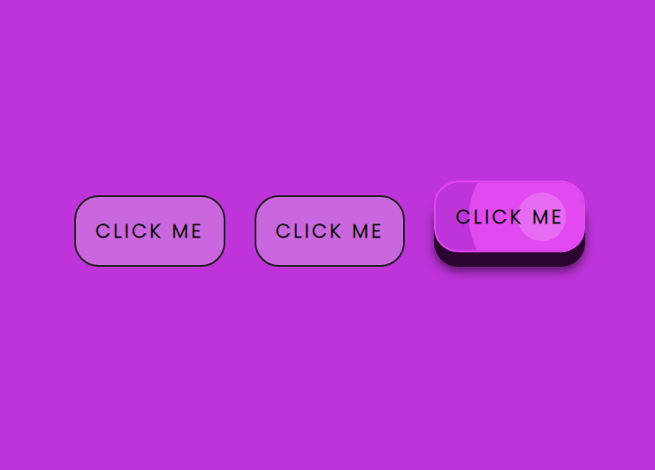
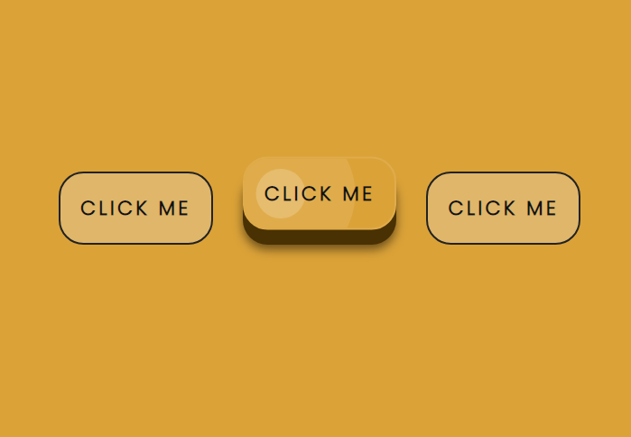

# Proyecto: Animación de Botones

Bienvenido al proyecto de Animación de Botones. En este proyecto, hemos creado una serie de botones interactivos con animaciones utilizando HTML, CSS y JavaScript.

## Capturas de Pantalla

## Características

- Botones llamativos con efectos de animación sutiles pero atractivos.
- Interacción fluida y sensible a eventos.
- Implementado con tecnologías web estándar: HTML, CSS y JavaScript.

## Cómo Ver

1. Clona este repositorio en tu computadora.
2. Abre el archivo `index.html` en tu navegador web.
3. Explora los botones animados y observa sus efectos al interactuar con ellos.

## Contribuciones

¡Las contribuciones son bienvenidas! Si deseas mejorar la animación, agregar nuevos efectos o solucionar problemas, no dudes en hacer un pull request.
